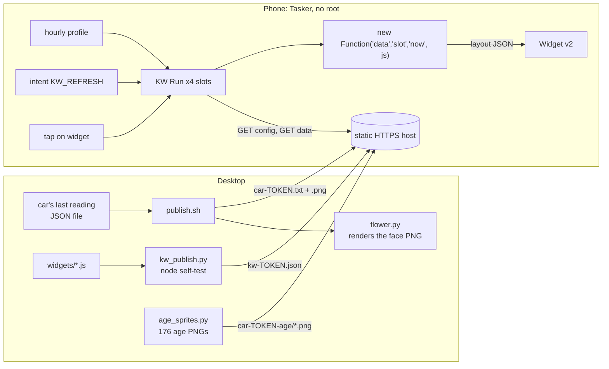

# tasker-remote-widgets

Android home-screen widgets, built with Tasker, that I redesign from my desktop without touching the phone: the phone fetches each widget's code from a URL and runs it.

> **Status: work in progress.** It has been running on one phone since 2026-10-04. The face and the age marks are still changing.

*Example faces rendered offline by `flower.py` and `age_sprites.py` from made-up readings.*

## Why I built it

My wife wanted to see the car's battery on her home screen at a glance. Her phone (a Galaxy, not rooted) runs Tasker, but without root I cannot edit Tasker's config remotely, so the usual tricks did not apply. I did not want her re-importing Tasker files every time I changed how the widget looks. I was not sure it could be done. It works.

## How it works

The phone gets three Tasker imports, once. They form a fixed shell. Everything a widget shows, and how it decides what to show, lives in one JSON file on a static HTTPS host. That file holds a small JavaScript program per widget slot.

Task **KW Run** takes a slot name (`car`, `k1`, `k2`, `k3`) and does five actions:

1. HTTP GET `kw-<token>.json?v=<time>` (the time defeats caching).
2. JavaScript: pick this slot's code and its data URL.
3. HTTP GET the data URL. For the car slot that is one line: `54 Disconnected 1791119700` (level, charging state, time of the reading).
4. JavaScript: `new Function('data', 'slot', 'now', js)` runs the slot's code, which returns a Widget v2 layout object.
5. Widget v2: draw the widget named after the slot with that layout.

Two profiles and the widget's own tap run it for all four slots: **KW hourly** (every hour) and **KW kick** (an Android intent, so the desktop can force a redraw).

So a widget can be redesigned from the desktop with no further imports: edit `widgets/car.js`, run `kw_publish.py`, and the next run picks it up.

**The face.** The desktop does the drawing. `flower.py` takes a flower painted by an image model (`art/plate_lit.png`, 24 petals) and greys out the petals past the battery level, one petal per ~4.2%. It writes the label, the percentage (red under 20%), and a glyph for the cable: bolt = charging, plug with a check = complete, plug = stopped, struck plug = cable out.

**The age.** Only the phone knows how old the reading is right now, so the phone picks the age mark. Tasker never tells a layout the widget's size, so text placed by offset landed in the petals. Instead `age_sprites.py` renders 176 transparent PNGs on the same square canvas as the face, with only the age mark drawn next to the glyph. `car.js` stacks the face and the right sprite as two scaled images, and they line up at any widget size. Each `|` is 10 minutes, the fifth is a slash through four, and a full hour becomes a digit: `1 ||` is 1 h 20 min. A day or more shows as a red `3d`.

**Guards.**
- `kw_publish.py` runs every slot's code in node on a sample reading before upload. It fails if the result is not a layout, or if the layout contains a literal `%`, because Tasker would read `%anything` as a variable.
- A slot with no widget yet runs `widgets/empty.js`, which throws. A Widget v2 action on a widget that is not on the home screen makes Android ask "add widget?", and the hourly run showed one of those per free slot. Throwing stops KW Run before step 5.
- Every Tasker action in the imports is cloned from a working Tasker export (`templates/actions.xml`, values blanked), and only one field is changed. Tasker's action arguments are undocumented, and a hand-written action can import and then do nothing.
- `make_fallback_widget.py` builds a single-widget import with the layout written in, for a Tasker that will not take a layout from a variable. On the target phone the variable layout worked, so the fallback is unused.

**Security.** The phone runs whatever JavaScript is in `kw-<token>.json`, with Tasker's permissions. The long random token in the file name is the only access control, so treat it as a password and let only your own machine write to that folder.

### Measured

- First render through the remote shell: 2026-10-04, on one phone.
- One timed remote change on 2026-10-04 (n=1): after the kick, the phone fetched the new config in the same second and the widget image one second later, read from the web server's access log. One run, not a rate.

## Install

You need:
- An Android phone with [Tasker](https://tasker.joaoapps.com/) with the Widget v2 action. No root.
- A Linux desktop that stays on, with Python 3, `pycairo`, `numpy`, `Pillow`, and Node.js for the self-test.
- The fonts Inter, Inter Display and FontAwesome 4 installed on the desktop.
- A static HTTPS host you can write to over ssh (any web server that serves a folder).
- For the car slot: something on the desktop that keeps the car's last reading in a JSON file with `usable_battery_level`, `charging_state` and `_read_at`. This repo does not talk to the car.

Steps:

1. `cp kw.env.example kw.env` and fill it in. Generate the token with the command in the file.
2. Load it: `set -a; . ./kw.env; set +a`
3. `./make_kw.py` writes three files to `build/`. Copy them to the phone's Downloads.
4. On the phone, in Tasker: import `KW_Run.tsk.xml` (long-press the Tasks tab header, Import Task), then import the two `.prf.xml` profiles the same way from the Profiles tab. **Tap Tasker's checkmark to save** after importing. Until you do, the profiles fail with "KW Run doesn't exist".
5. On the desktop: `./age_sprites.py`, then `./publish.sh`, then `./kw_publish.py`.
6. Wait for the hourly run, or run KW All once in Tasker. Android asks to add the `car` widget; tap Add.

## Running it

- New reading: run `publish.sh` (a systemd path unit on the JSON file plus an hourly timer works well).
- Change a widget's look or logic: edit `widgets/<slot>.js`, run `./kw_publish.py --dry` to test, then `./kw_publish.py`.
- Add a widget: write `widgets/k1.js`. If it needs data, add its URL to `FETCH` in `kw_publish.py`. The phone offers to place it on the next run.
- Change the face: edit `flower.py`, preview with `./flower.py 54 Disconnected /tmp/face.png --label CAR`. After moving the glyph, re-run `age_sprites.py`.
- Redraw now (optional): `./kw-kick.sh` sends the intent over ssh. This needs an ssh server on the phone (I use Termux's `sshd`). Without it, the hourly run and a tap on the widget still work.

## Not included

- The token, host names and the phone setup scripts that hold my network addresses.
- The code that reads the car. On my side it is a separate project that writes the JSON file this reads.
- The same desktop also drives a weekly calorie widget and a battery meter on my own phone's launcher. Those embed personal health numbers and a personal home-screen layout, so they stay private. The Tasker action shapes in `templates/actions.xml` were lifted from that working export.
- Tasker itself, a third-party app.

## Built with Claude Code

I designed and debugged this with Claude Code, which wrote most of the code while I tested it on the phone and made the design calls. The flower was generated with Codex's image tool.

## License

MIT, see [LICENSE](LICENSE).
